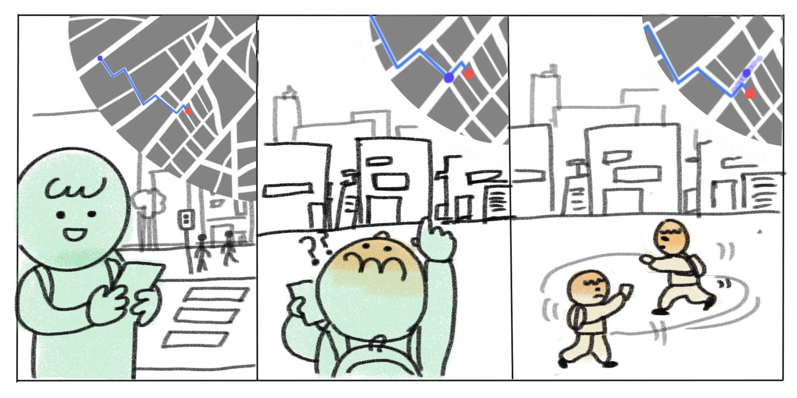
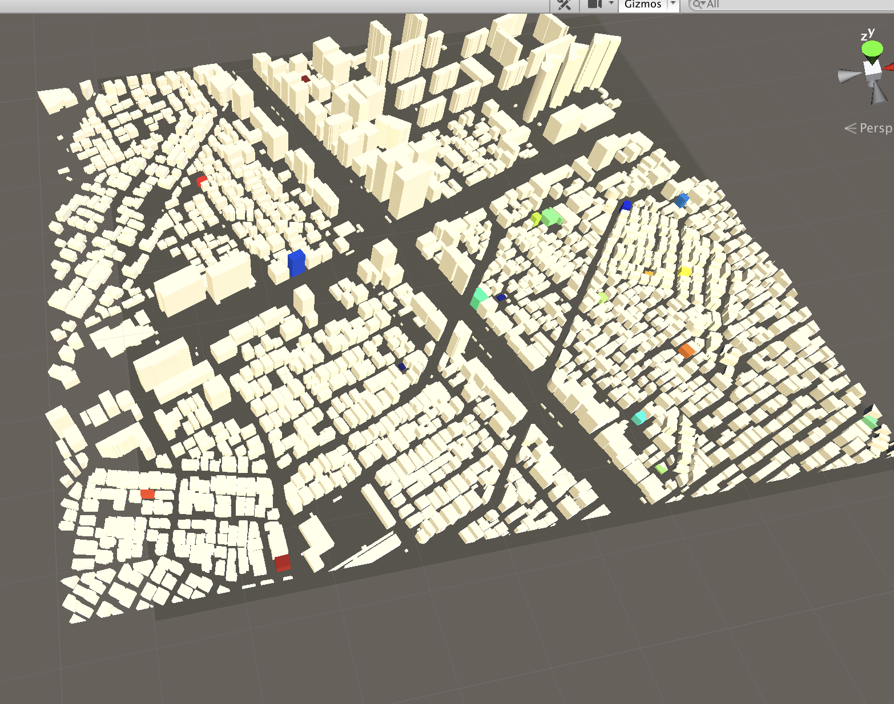
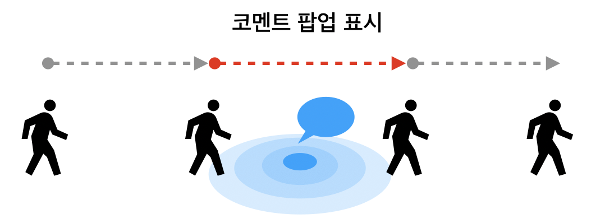

# 사회적 길찾기 SocialAR Navigation
{: .no_toc }

## Table of contents
{: .no_toc .text-delta }

1. TOC
{:toc}

---

기간: Sep 3, 2019 → Dec 30, 2019
대표 프로젝트: Yes
역할: UX 리서치, UXUI 디자인, 개발
키워드: AR, Mobile Navigation, Research Project
프로젝트 형태: 졸업 논문

# Overview

**기간** | 2019.09. ~ 2019.12.
**역할** | 연구 계획 및 실행, 프로토타입 제작  
**플랫폼** | Mobile AR, VR

걸어서 길을 찾는 과정에 응용할 수 있는 새로운 내비게이션 방법을 제안하고 검증했습니다. 자동으로 계산된 경로가 사용자들이 직접 지나다닌 길이라고 하는 프레임을 제공했을 때 길을 찾는데 걸리는 25%로 줄었고, 인지 부하가 10% 줄어든 것을 확인할 수 있었습니다. 

- **Table of Content**

---

# Background

새로운 장소로 이동할 때, 지도앱에서 알려주는 길만 보고 찾아가는 것도 힘든 상황이 있습니다. 이때 사용자들은 한참을 목적지 앞에서 헤매기도 하고 복잡한 골목길에서는 어느 길로 가야 할지 결정하기 어렵습니다. 이 때, 사람들이 블로그를 참고하여 다른 사람들이 찾아간 경험을 참고하여 가는 방법을 선택하는 현상을 발견하고 연구를 진행했습니다.

**용어 설명** 

**사회적 내비게이션** Social Navigation 
다른 사용자의 발자취를 따라 내비게이션을 하는 것을 의미합니다. 온라인 환경에서 활발하게 쓰이는 예시는 조회수, 평점, 리뷰, 채팅 등의 내비게이션 단서입니다.  물리적인 환경에서의 대표적인 예는 동행자와 협력하기, 주위의 다른 무리를 따라가기, 선행된 행동의 흔적 등을 들 수 있습니다.

---

# Problem

먼저 기존 GPS기반 지도앱의 한계점을 파악하고 이를 극복할 수 있는 방안을 도출하려 했습니다. 핵심 문제점은 다음과 같습니다.

- 복잡한 환경에서는 **지도에서 보이는 정보와 현실 공간을 매치시키기 어렵다.**
- 목적지에 근접했을 때 **최종 목적지의 위치를 인지하기 어렵다.**
- **개인의 능력에 따라 길찾기 시간에 소요되는 시간이 다르다.**

---

# Research

## Interview

### 1. User pain point

인터뷰를 통해 도출한 불편한 경험 시나리오 - 을지로의 한 가게를 찾아가는 P씨

인터뷰 조사를 통해 도보 길찾기 이용시 최종 목적지에 도달하기 까지 어려움을 겪은 경험을 도출했습니다. 
사용자들은 "목적지 근처까지는 쉽게 도달할 수 있다"고 합니다. 하지만 "실제로 가려고 했던 가게까지 가는 것은 종종 오래 걸린다"고 응답하였습니다. 이처럼 최종 목적지 까지 추가로 시간이 소요되는 경우가 있었습니다.
특히 이런 일이 자주 발생한 지역은 **좁은 길이 반복되어 구분하기 어렵거나 GPS지도로 정확한 위치를 확인하기 어렵다는 특징**이 있었습니다. 

- 을지로, 이태원 등 비정형 골목길
- 복합 상가, 작은 상가가 밀집되어 있는 곳
- 큰 빌딩의 실내 매장

### 2. How do users solve this problem?

비슷한 문제가 생겼을 때 사람들은 **블로그나 인스타그램**을 살펴보며 비슷한 그림을 찾듯이 단서를 얻으려 노력합니다. 이처럼 다른 사람의 흔적을 따라가는 행위를 Social Navigation이라고 합니다. GPS지도에서 제공하는 정보로는 충분한 단서가 되지 않아 다른 방문자의 흔적을 찾는 것을 선호합니다. 

## Related Works

### **<Limitation of GPS Navigation>**

보조 내비게이션 중에는 시스템에 완전히 의존할 수 있습니다. 이때 사용자들은 둘러싼 환경에 주의를 기울이지 않는데 이는 공간적 지식 습득을 저하시키게 됩니다.(Brugger,2019)

또한 GPS 사용은 개인의 인지적 능력이 낮으면 공간 지각이나 공간 탐색 사고에 부정적인 영향을 끼칠 수 있습니다.(Ruginski, 2019; Ishikawa, 2019)

### **<Social Navigation>**

이 방식은 지금도 웹서비스에서 자주 사용 되고 있습니다. 어떤 목적을 가지고 웹사이트에 들어왔을 때 선택에 도움이 되는 일련의 정보를 하이라이트 해주거나, 조회수를 표시해두거나, 평점을 제공해줍니다.

Dalton의 연구는 길을 찾아가는 행위는 개인적인 활동이 아님을 시사합니다. 사람들은 길을 찾는 행위 중 사회적 존재감이 적은 상황에서도 다른 사람들의 행동에 영향을 받습니다.(Dalton, 2019)
- 소셜 네비게이션 지원은 공간에 Social Affordance를 추가함으로써 정보 공간 내에서 사용자의 참여를 증가시킬 수 있습니다.(Wong, 2015; Farzan, 2018)

### <AR Navigation>

AR을 사용할 경우 사용자는 실제 세계와 가상 컨텐츠의 통합을 통해 자신의 환경을 더 잘 이해할 수 있으며, 이는 사용자 환경과의 인식과 상호 작용의 수준을 높인다고 합니다.(Nilsson,2012)

AR이 사람 길 찾기 행동의 시간과 인지 작업량을 크게 줄일 수 있음을 알 수 있습니다. Kim은 병원을 맥락으로 길찾기 인지 과정에 영향을 미치는 도구를 개발하고 AR을 사용한 복잡한 환경에서의 사용자 경험을 연구했습니다.(Kim et al.,2015)

---

# Goal

**AS IS** 

GPS 지도로 길찾는 경험

- 구체적인 정보가 없어 정확한 위치를 찾기 어려움

- 평면 지도의 기호를 해석해야함

**TO BE**

제안하는 SociAR Navigation
- 소셜 내비게이션 : 최종 목적지를 찾을 수 있는 구체적인 안내 주기

- AR 내비게이션 : 지도의 정보를 현실 공간과 매치하기

# Development Process

### Step 1 : 실험 시나리오 정의

2X2 within subject 실험 설계를 활용하여 실험 대상의 수와 실험 조건을 정의했습니다. 순서 효과를 상쇄하기위해 모든 참가자는 A, B, C, D의 네가지 조건을 무작위 순서로 태스크를 수행했습니다. 가설 검정을 위해 AR인터페이스의 시나리오를 테스트 할 수 있는 VR 시뮬레이션 기법을 사용해 통제된 실험 환경을 조성하여 실험을 진행했습니다.

### Step 2 : VR 시뮬레이션 환경 테스트

[시뮬레이션 테스트](https://twitter.com/Boqqus1/status/1235100600552968194?s=20)

Unity의 Render Texture 이미지를 사용해 가상의 스마트폰 화면을 구현했습니다. 러프한 모델과 환경 테스트 후 실제 실험에 사용될 환경을 다시 재구축했습니다.  

### Step 3 : 맵 환경 구성하기

공학자 친구의 도움으로 실제 BIM 데이터 추출하여 실험 대상 지역인 강남구 논현동, 용산구 보광동 근처 건물의 3D 데이터를 불러왔습니다. 이 모델에 이제 건물의 텍스처를 입히게 되어 '가상의 실제 환경'이 구현됩니다.

### Step 4 : 가상의 스마트폰 UI 디자인

[가상의 스마트폰 실험](https://twitter.com/Boqqus1/status/1237446718355996673?s=20)

가상의 스마트폰에 보일 화면을 XD에서 디자인한 뒤 유니티 상에서 UI를 만들어주었습니다. 

이 UI는 정해진 영역을 지나갈 때, 근처 태그된 영역에 반응하여 맥락에 맞는 방문자 코멘트를 팝업으로 띄워줍니다.

GPS 인터페이스와 SociAR 인터페이스는 그림과 같이 다른 화면을 보여줍니다.

### Step 5 : Task 설계

VR을 활용해 실험에서는 헤드셋을 쓰고 조작하는 과정에서 멀미가 생길 수 있기 때문에 피험자를 지치지 않게 하는 것이 중요했습니다. 각각 5분 - 10분이 걸리는 태스크 2회 후 충분한 쉬는 시간을 제공하여 테스트를 진행했습니다.

모든 피험자는 VR 환경 적응, 이동 방법 학습, 정확한 설문지 입력을 위해 연습하는 트레이닝 세션을 거쳤습니다. 

각 조건마다 보이는 화면들

---

# Test Result

10명의 파일럿 테스트를 거치고난 뒤 25명의 참가자가 본실험을 진행했습니다.

### 수행도

경로가 단순할 때와 복잡할 때 두가지 조건에서도 차이가 보였습니다. 복잡하고 좁은 길에서 더 많은 오류가 생겨났으며 예상치 못한 결과를 관찰할 수 있었습니다. 단순한 경로에서는 GPS와 SociAR 조건에 차이가 없을 것이라 예상했지만 참가자들은 GPS에서 더 많은 오류와 지연을 발견할 수 있었습니다.

- **환경에 따라 자신의 위치와 길을 확인하는 방법이 다르다**

    또, 경로가 복잡해짐에 따라 지도를 참고하는 기준이 달라지는 것을 확인할 수 있었습니다. 단순한 경로에서는 지도상의 현위치에 집중하여 길을 찾는 모습이 관찰되었습니다. 복잡한 경로에서는 지도상의 길 모양, 건물 모양을 비교하여 길을 찾아가는 모습을 볼 수 있었습니다. 이 차이는 환경에 따라 자신의 위치와 길을 확인하는 방법이 다르다는 사실을 발견할 수 있었습니다.

    

- **태그를 읽는 방식도 달라진다**

    경로가 복잡해짐에 따라 소셜 태그를 대하는 사용자의 차이도 달라졌습니다. 단순한 경로에서는 난이도가 낮아 소셜 태그와 이동을 동시에 하며 지나갈 수 있었지만, 복잡한 경로에서는 소셜 태그를 읽고나서 주변 환경을 비교하는 과정이 추가적으로 소요되어 시간이 더 많이 걸렸습니다.

    

### 인지부하

인지부하는 전체적으로 GPS 지도를 사용했을 때보다 SociAR 방식이 더 낮은 인지부하를 나타내는 것을 알 수 있었습니다. 정량적인 자가보고 설문지와 인터뷰를 통해 인사이트를 도출했습니다.

- **길치는** **SociAR이 더 편안하지만 길을 잘 찾는 사람들에겐 GPS가 더 편하다**

    인터뷰 중 ‘따라간다’는 것에 대한 양가적인 반응이 관찰되었는데, SocialAR경로를 따라가는 것에 대해 정신적인 부담이 줄어들어 긍정적으로 받아들이는 피험자와 전체적인 경로를 예상하기 어려운 이유로 부정적으로 받아들이는 피험자로 나누어졌습니다. 주로 경로가 단순한 환경에서 , GPS 지도를 사용할 때보다 **SocialAR 인터페이스를 사용할 경우 표시된 경로와 코멘트를 따라가는 것에서 여유와 편안함**을 느끼는 것도 알 수 있었습니다.

### 사용 경험 및 몰입

사용자 경험 및 몰입 항목에서 큰 차이를 나타낸 요소는 **사용 지속성Endurability , 참신성Novelty, 인지된 사용성 Perceived Usability** 이었습니다. 사용자들은 SociAR 인터페이스를 더 오래 사용하고 싶어했습니다. 

특히 **콘텐츠의 내용에 따라 유용성이 달라지는 것**을 알 수 있었습니다. 구체적인 기준점 표시가 없는 메세지나 부가적인 내용이 있을 수록 사용자는 소셜 태그를 노이즈로 느끼는 것을 알 수 있었습니다. 막연한 방향 전달은 오히려 길찾기에 혼란을 줄 수 있다는 사실을 유념해야합니다.

### 공간 기억 습득

기억하고 있는 정도의 차이는 **복잡한 경로에서 더 크게 나타났습니다.** 복잡한 경로에서 랜드마크를 기억하는 정도는 SociAR조건이 더 높았습니다. 왜냐하면 계속 둘러보며 다녀야하고 소셜 태그 메시지에 명시되어있던 정보가 많았기 때문입니다. 반면 경로 회상 과제에서는 GPS를 사용한 조건이 더 높았습니다. 그 이유는 전체 경로의 흐름을 더욱 기억하기 쉬웠기 때문입니다.

---

# Epilogue

### 프로젝트 결과

가설이 정말 많지 않나요! 정말 다양한 궁금증을 한번에 해결하려고 했었습니다. 설문지가 사전설문, 인지부하, 경험 및 몰입, 사후 설문 등 4개나 있었고 이걸 반복해서 측정했으니..😅 피험자분들이 참 고생하셨습니다. 덕분에 이렇게 여러 가설을 시험하고 검증할 수 있었습니다.

### Design Implication

- 앞으로 갈 길을 예상할 수 있는 **단거리 경로 시각화**가 필요합니다.
- 경로가 복잡해진 상황에서도 비슷한 결과가 나올 수 있도록 하려면 소셜 태그의 메세지의 **정보 전달이 명확**하고 **구체적인 기준점이 제시**되어야 합니다.
- 사용자의 목표와 관련있는 태그를 구분할 수 있는 방식, **태그의 성격에 따라 컬러 코딩**이 필요합니다.
- 전체 맥락을 파악할 수 있는 **전체 경로 제시**해야 합니다.
- 신뢰도를 판단할 수 있도록 **사용자간의 평가 시스템**이 필요합니다.

### 프로젝트 소감

아이디어를 내는데만 2달 가까이 걸렸던 것 같습니다. 3개월동안 연구를 진행하고 결과를 정리하며 일당백으로 문헌연구, 프로토타입 개발, 피험자 모집 등 여러 임무를 맡아서 진행해야 했습니다. 그래도 정말 다행인 것은 그 중에 제가 할 수 없었던 현실 BIM 모델 만들기, 데이터 추출 파트를 도와준 친구들이 있었다는 것입니다. 정말 감사했습니다. 아직 없는 서비스의 니즈나 제안을 하는 것은 어찌보면 뜬구름 잡는 일 일수 있었지만. 실험 결과를 반복해서 보며 의미 있는 인사이트를 뽑아내는 과정이 즐거웠습니다.
